# <a id="Top-of-Page"> Welcome to the Passive Investment WebApp!</a>
#### A financial database and web application to analyze the performance of a hypothetical fintech ETF.

***
## <a id="Contents">Cotents</a>
[Project Description](#Project-Description) 
[Technologies](#Technologies) 
[Installation Guide](#Installation-Guide) 
[Usage](#Usage) 
[Contributors](#Contributors) 
[License](#License) 
[Bottom of Page](#Bottom-of-Page) 

***
## <a id="Project-Description">Project Description</a>
This webapp analyses and visualizes exchange-traded fund (ETF) portfolio performance.

#### A summary of what's under the hood:    
This project aims to analyze and visualize the ETF portfolio by doing the following:
 - Analyze a single asset in the ETF
 - Optimize data access with advanced SQL queries
 - Analyze the ETF portfolio
 - Deploy the notebook as a web application 

#### Project layout:
The layout of essentials for this project is show below.

<a href="tree.txt">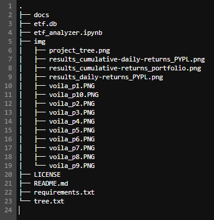</a>

***
## <a id="Technologies">Technologies</a>
<a href="https://docs.python.org/release/3.8.0/" title="https://docs.python.org/release/3.8.0/">

 
<a href="./requirements.txt" title="requirements.txt">Requirements List</a>

***
## <a id="Installation-Guide">Installation Guide</a>
### Project Installation
To install <a href="https://github.com/jasonjgarcia24/passive-investment-webapp" title="https://github.com/jasonjgarcia24/passive-investment-webapp">passive-investment-webapp</a>, type <code>git clone https://github.com/jasonjgarcia24/passive-investment-webapp.git</code> into bash in your prefered local directory.  
Alternatively, you can navigate to the same address (<code>https://github.com/jasonjgarcia24/passive-investment-webapp.git</code>) and download the full <code>main</code> branch's contents as a zip file to your prefered local directory. 

***
## <a id="Usage">Usage</a>
### Inputs
Observe passive-investment-webapp with <code>passive-investment-webapp.ipynb</code>. The <code>etf.db</code> database file is required for access to the ETF data. 

### Outputs
The tools provides three necessary visualizations for ETF porfolio analysis:
1. An interactive line chart for the selected PYPL daily returns: 
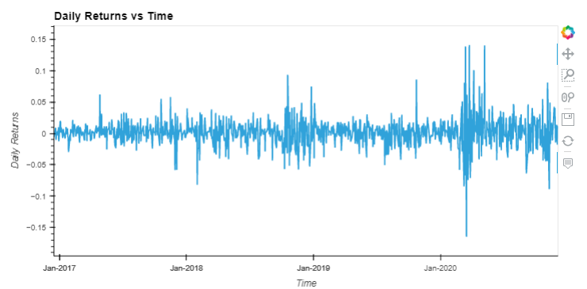 

2. An interactive line chart for the selected PYPL cumulative daily returns: 
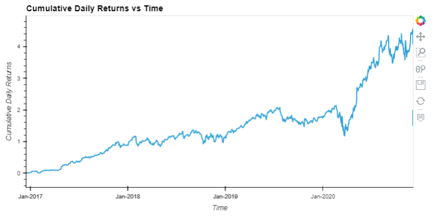 

3. An interactive line chart for the ETF portfolio's cumulative annualized returns: 
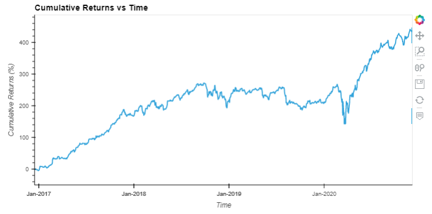 
    
Using Voilà, the following screenshot recordings capture the webapp:
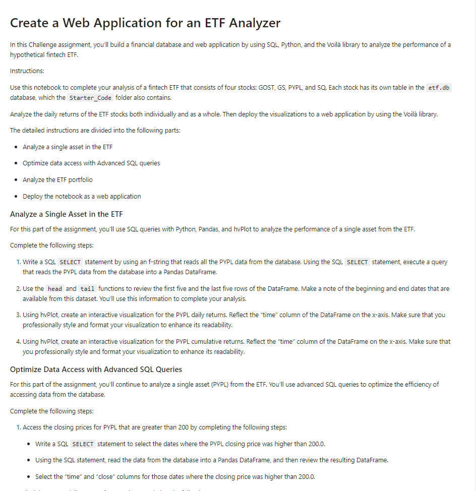 

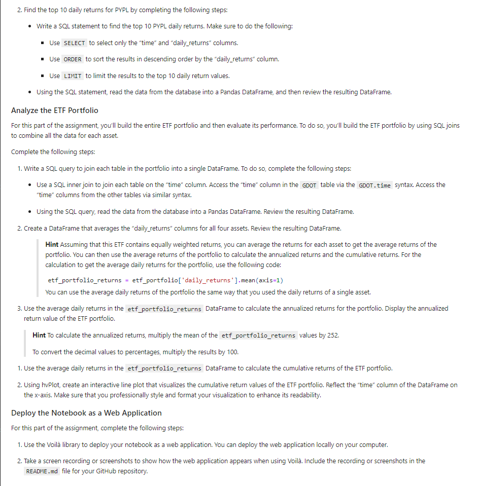 

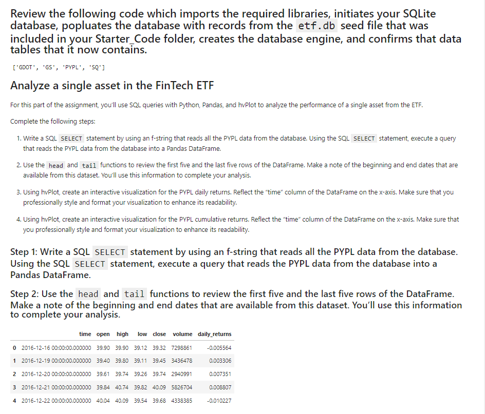 

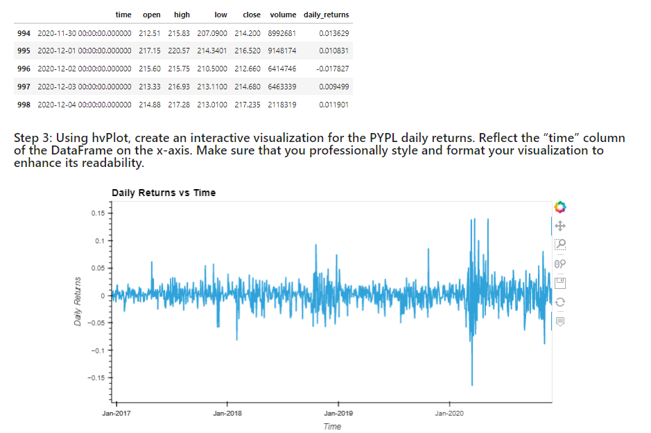 

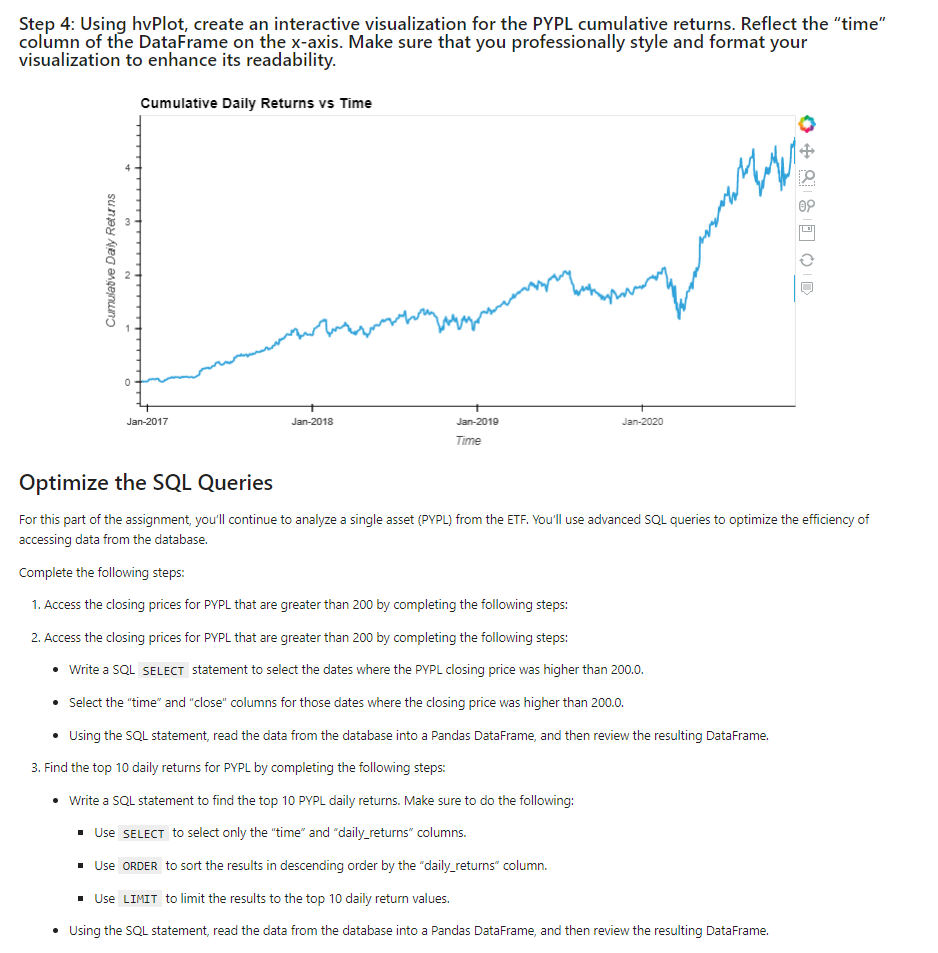 

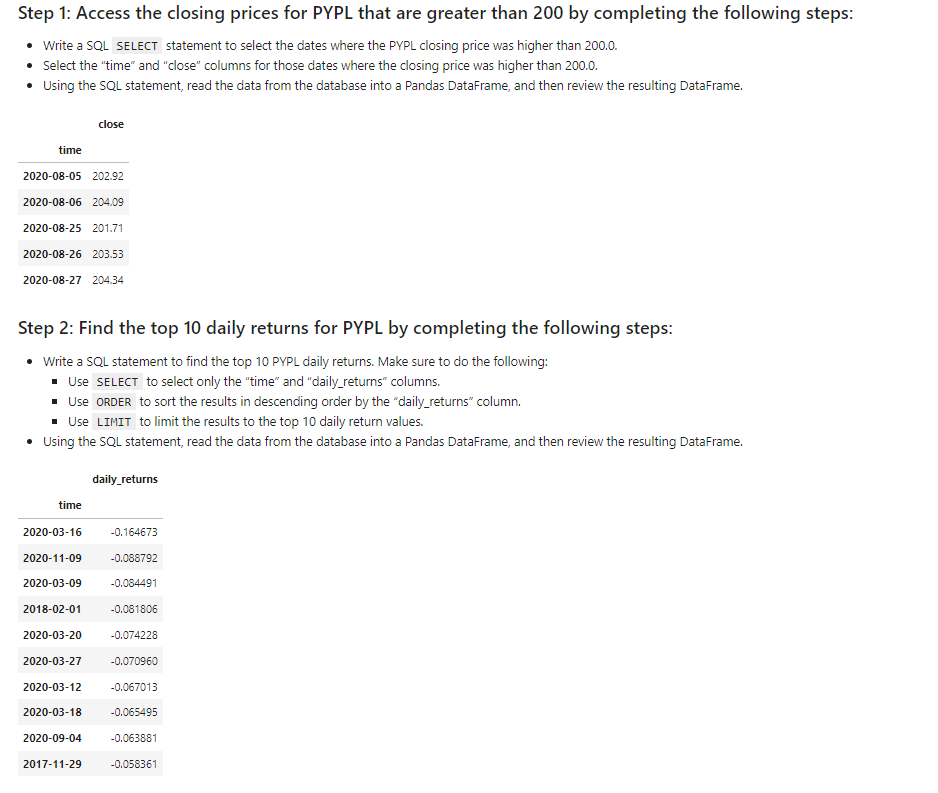 

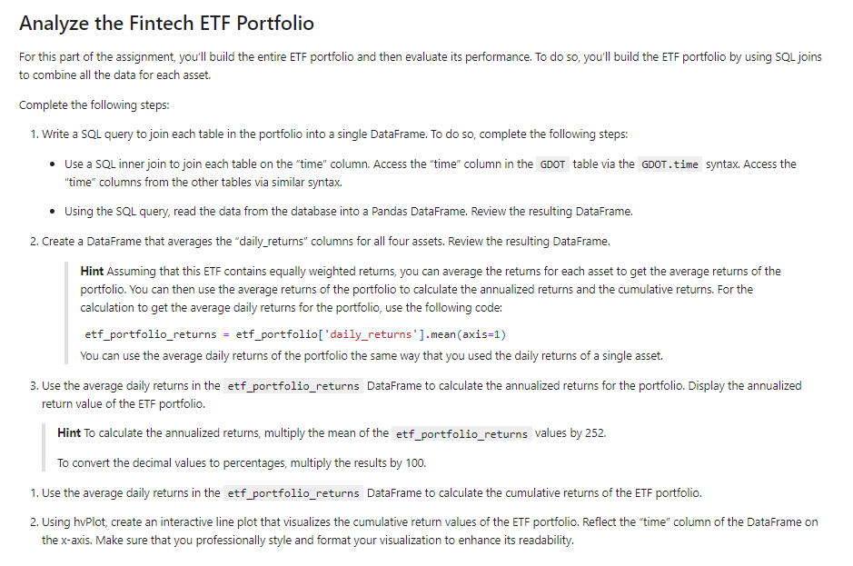 

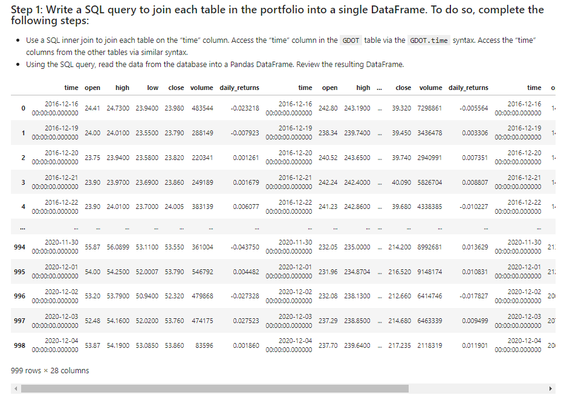 

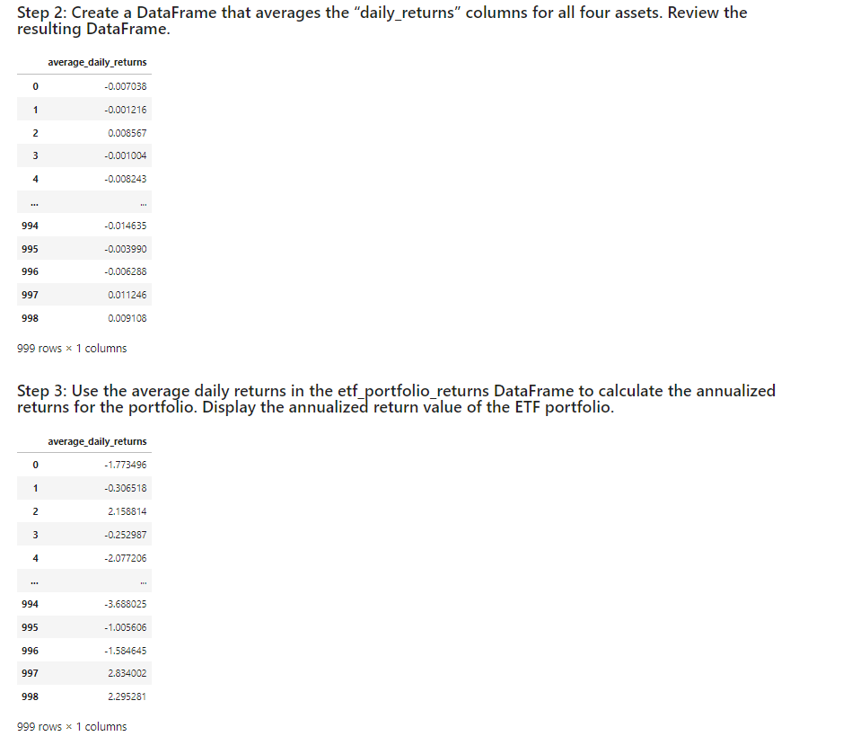 

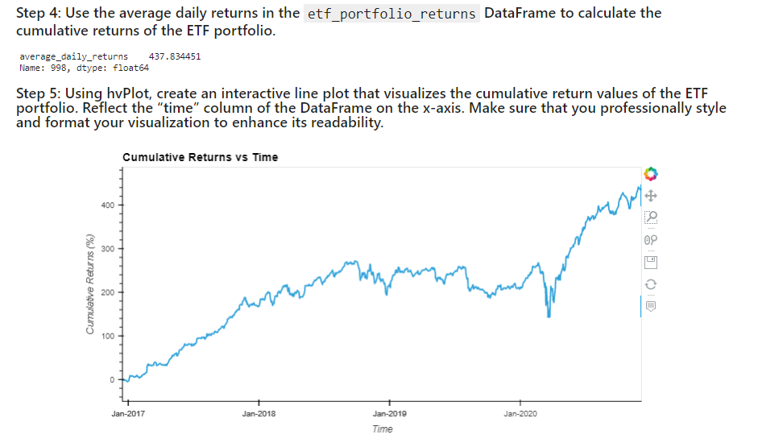 

***
## <a id="Contributors">Contributors</a>
Currently just me :) 

***
## <a id="License">License</a>
Each file included in this repository is licensed under the <a href="https://github.com/jasonjgarcia24/passive-investment-webapp/blob/586c7f7d1555c5effd9f271418a7cca2e6279a03/LICENSE" title="LICENSE">MIT License.</a>

***
[Top of Page](#Top-of-Page) 
[Contents](#Contents) 
[Project Description](#Project-Description) 
[Technologies](#Technologies) 
[Installation Guide](#Installation-Guide) 
[Usage](#Usage) 
[Contributors](#Contributors) 
[License](#License) 

    
    

